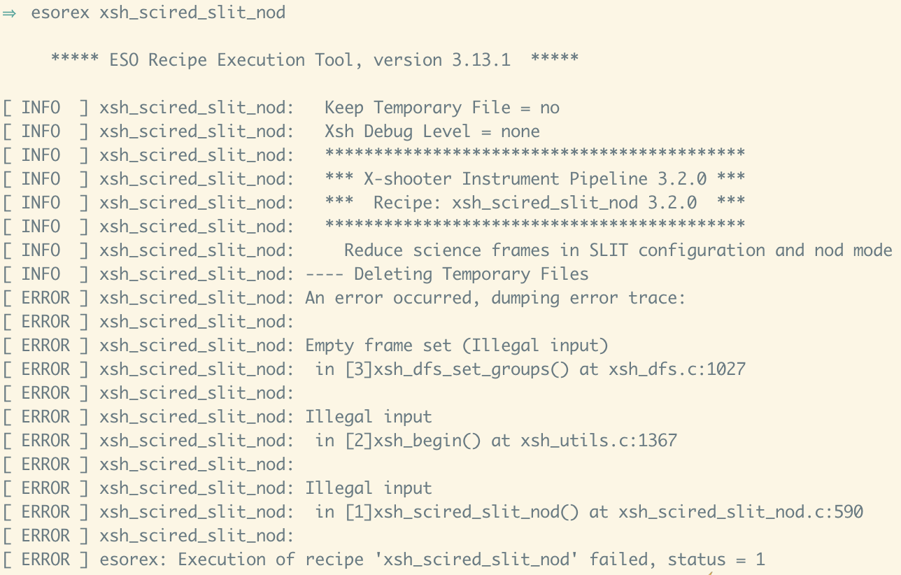

These rutines along with associated static calibration files should allow the quick reduction of X-shooter spectra.

This script relies the ESO X-shooter pipeline, as well as Python and astropy. Information on the ESO pipelines can found at https://www.eso.org/sci/software/pipelines/, as well as instructions on how to install. This quick-reduction pipeline relies specifically on Esorex - the ESO recipe excecution framework. Before execution, run

```
esorex
```

from the command line. You should get something similar to this:


Additionally, the X-shooter pipeline needs to be installed and assesible to esorex.

Running

```
esorex xsh_scired_slit_nod
```

from the commandline should return something similar to:



There is no strict requirement on the version of the pipeline, but much older versions of the pipeline could cause breakage of the code.


To setup a python evironement with conda, download anaconda (https://www.anaconda.com/download) and do:

```
conda create -n py36 python=3.6
```

```
conda install astropy
```

Alternatively, if you have a working python environment that you prefer, astropy can be installed through pip. This scripts should be compatiple with both Python 2 and Python 3, so there should be no need for any major changes to your python environment.

The script can be run from the commandline using:

```
python ARM.py
```

where ARM=UVB, VIS or NIR.

NOTE: You have to be in the actual directory to run this command, otherwise the path to the python script need to be given.

The small shell script xsh_qr.sh has been made for convenience. It will run the reduction for all arms, and spawn new processes, thus running the three arms simultaneously. 

It can be run using

```
sh xsh_qr.sh
```

The pipeline is made to be robust and there is not a lot of flexibility allowed. A few things can be changed in the ARM.py scripts though (clearly indicated in the scripts).

You can change the folder name in which you have the data to be reduced. The default is: XSHPipelineManager/ARM/target. We recommend the same folder structure. The fits images have to be unzipped.

By default the pipeline runs in nodding mode, i.e. you need to provide at least two files (one nodding cycle) per arm. If you want to
run the pipeline in staring mode, comment the nodding- and uncomment the staring-mode lines in the ARM.py scripts.

In the case of staring reduction the pipeline checks the DIT in the NIR arm and chooses the correct masterdark.

The pipeline checks whether observation is done in the K-blocking mode or not.

Wavelengths are in air. No extinction correction is applied to the final products.

See https://github.com/martinsparre/XSHPipelineManager for the original source. All credit for the original scripts goes to Martin Sparre.
